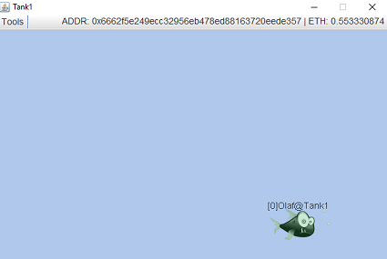

# AqualifeDApp
This is an implementation of the program 'Aqualife' as a distributed application for the ethereum network. The project is part of a Bachelor's thesis at the University of Applied Sciences in Konstanz ([HTWG](https://www.htwg-konstanz.de)).

## Overview

This project consists of a java application which uses a library to interact with an ethereum node and appropriate smart contracts. The program allows you to buy and trade `FishToken` in a very basic way. These `FishToken` can swim in the network between participating clients called `Tanks`. Each action is managed and controlled by three smart contracts, which depend on each other:

1. `FishBase`: Implements the ERC721 Non-Fungible Token standard partially. Responsible for holding `FishToken` and transferring ownership of them
1. `Broker`: Does the `FishToken` handoff (swimming), `Tank` registration and more
1. `Marketplace`: Responsible for buying (creating) and trading `FishToken`

## Install

The following programs are necessary to run and build the project. To simply run the application on the public testnet, you just need the ethereum node `geth`. Make sure that you can run each program in the console/terminal (e.g. add the programs to PATH on Windows).

| Program | Version | Description                                           | Download                                                  |
|---------|---------|-------------------------------------------------------|-----------------------------------------------------------|
| geth    | 1.8.12  | Ethereum node implemented in Go (CLI)                 | [here](https://ethereum.github.io/go-ethereum/downloads/) |
| solc    | 0.4.24  | Solidity compiler for smart contracts                 | [here](https://github.com/ethereum/solidity/releases)     |
| web3j   | 3.4.0   | Java library and CLI for generating contract wrappers | [here](https://github.com/web3j/web3j/releases)           |
| gradle  | 3.2.1   | Build tool for the java application                   | [here](https://gradle.org/install/)                       |
| python  | 3.7.0   | Programming language used for the utilities script    | [here](https://www.python.org/downloads/)                 |

## Run the application

To start the program, you need a running ethereum node and an account which holds some ether.
You can run the ethereum node either locally on a private test network or on the public ropsten test network (see below).
After that, you can run the java application located at `./jar/AqualifeDApp.jar`. The java application will use the smart contract addresses specified in the file `./jar/contract_address.txt`. By default, these are the addresses of the contracts deployed on the public ropsten test network. This file will be overwritten if you deploy the contracts by your own.

First, start a terminal and change to the AqualifeDApp root directory. Type in the following commands:

### On Private Test Network

Use the utilities python script `aqualife.py` for setting up a private test network with `geth`.

1. Initialize a private blockchain and create some test accounts with some ether: `python ./aqualife.py init`
1. Run the private node locally: `python ./aqualife.py run`
1. The ethereum node will start to mine transactions automatically
1. Deploy the smart contracts on this blockchain (see chapter 'Deploy Smart Contracts')
1. Run the java application `AqualifeDApp.jar`
1. The application will ask for your account (wallet file) and password (default: 'test'). The path to the wallet files is: `./test/ethereum/keystore`

### On Public Test Network (Ropsten)

1. Create an account: `geth --datadir ./test/ropsten --testnet account new`
1. Get some test ether via the [ropsten faucet](http://faucet.ropsten.be:3001/). Make sure that the queue is not full! You can check your balance e.g. on [etherscan](https://ropsten.etherscan.io/) by searching your address.
1. Run the ethereum node: `geth --datadir ./test/ropsten --testnet --syncmode "light" --rpc`
1. Wait until the block synchronization starts and until the node is up-to-date (console output should be `count=1`). 
1. Run the java application `AqualifeDApp.jar`
1. The application will ask for your previously created account (wallet file) and password. The wallet file should be at `./test/ropsten/keystore`.

## Build

Run the command `python ./aqualife.py build` to build the project. This will do:

1. Compile smart contracts written in solidity with `solc`
1. Generate the java wrapper classes with the `web3j` command line tool
1. Compile the whole java project with `gradle` and create the executable jar file

Note: `gradle` needs a properly installed JDK. You can specify the JDK to be used in the `aqualife.py` script if any error occurs.

## Deploy Smart Contracts

First, make sure that an ethereum node is running (on private or public testnet, see above). The `AqualifeDApp.jar` contains also the functionality to deploy the smart contracts. To call this special class in the jar, execute the command `python ./aqualife.py deploy`. You will be asked for an account (wallet file) and a password. Some information windows will pop up when finished.